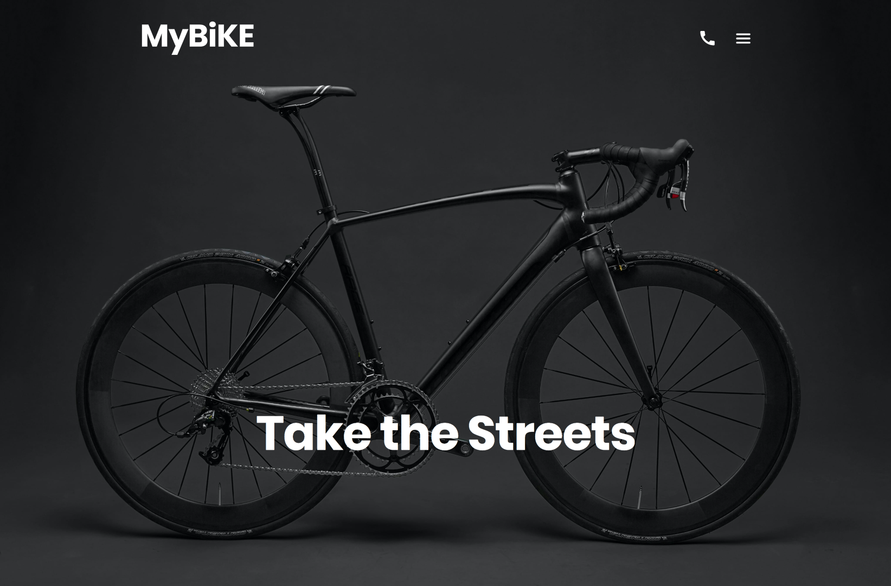
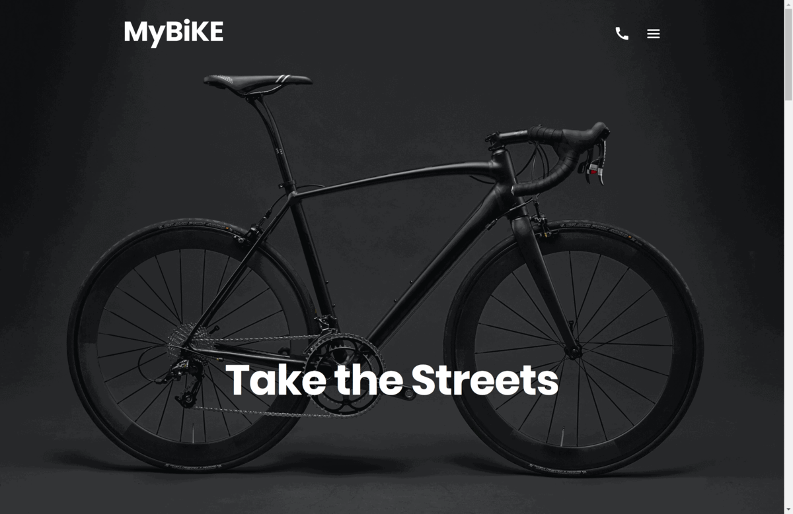

# 

# MyBike Landing Page

A responsive webpage created using semantic HTML, SCSS and JavaScript.

## Live Preview

Here is a working live demo : [Preview](https://stanislavcodes.github.io/landing-mybike/)

## Built with

- Semantic HTML5 markup
- CSS3: Grid, Flexbox
- BEM methodology: [BEM](https://en.bem.info/methodology/)
- Preprocessors: [Sass](https://sass-lang.com)
- Mobile-first workflow

## More Screenshots
# 

## Author

- Github - [stanislavcodes](https://github.com/stanislavcodes)
- LinkedIn - [Stanislav Korchevskyi](https://www.linkedin.com/in/stanislav-korchevskyi/)
- Telegram - [@stanislavcodes](https://t.me/stanislavcodes)
